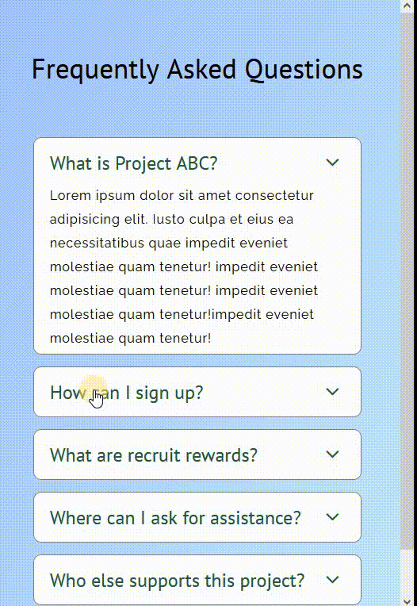

# 🛠 SASS - Simple accordion

# 🔗 [Live Preview](https://633a04815adf252f15f32dd0--monumental-gecko-700d89.netlify.app/)

## Welcome! 👋

- In this short project, I focus on making a very simple responsive accordion using SASS only.

### Languages and features 👨‍💻 

- SASS: nesting, responsive page, media queries.

Thanks for checking out my projects
